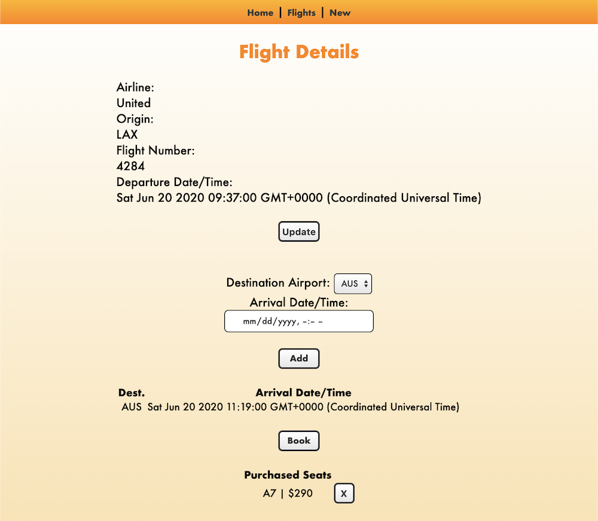

### Date: 3/2/2020

#### By: Michael Lackey
#### [Website](https://michaellackey.com/) | [GitHub](https://github.com/mlackey9601) | [LinkedIn](https://www.linkedin.com/in/michaelglackey/) | [GA Profile](https://profiles.generalassemb.ly/michaellackey)
***

### ***Description***

##### A Node.js/Express app for logging and tracking flights.
***

### ***Technologies Used***

##### ***Additional Technologies***
* ###### Chajr 1.1.4
***

### ***Getting Started***

##### Use this application to keep track of flights. New flights can be added to the list, destinations can be added to each flight, and seats can be booked for each flight. Use the nav bar on top to move easily throughout the views.
##### The project has been deployed to Heroku and can be viewed [here](https://mongoose-flights-lab.herokuapp.com/).
***

### ***Screenshots***

###### Main Page

###### List of Flights

###### Flight Details

###### Add a Flight

###### Book a Seat

***

### ***Future Updates***

- [x] ~~Style the app~~
- [x] ~~Add a navigation bar to easily navigate the views~~
- [x] ~~Add the ability to edit existing flight details~~
- [x] ~~Add a feature to delete a flight~~
- [x] ~~Add a feature to delete a flight's ticket~~
- [ ] Display the default departure date when displaying the new flight form
- [ ] List the flights by departure date in ascending order
- [ ] Flights displayed using red text if the flight's departure date has passed
- [ ] List destinations for a flight by the arrival date/time in ascending order
- [ ] Exclude airports listed that have already been used by other destinations and/or the flight's airport
- [ ] Create a better layout for flight information
***

### ***Credits***
  
##### App Scaffolding: [Chajr 1.1.4](https://github.com/davidstinson/chajr)
***
